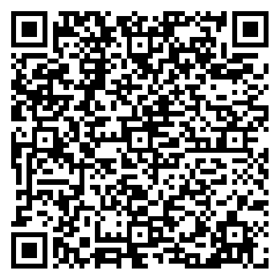

# 🐰 Rabbit R1 OpenClaw QR Generator 🦞

[](https://github.com/johndotpub/rabbit-openclaw-qr-generator/actions/workflows/test-index.yml)
[](https://github.com/johndotpub/rabbit-openclaw-qr-generator/actions/workflows/test-websocket.yml)
[](https://unlicense.org/)
[](https://forum.rabbitcommunity.tech/t/how-to-connect-your-r1-to-openclaw-formerly-moltbot-clawdbot/15646)
[](https://rabbit.tech)

> 🔗 **Live site:** self-host by opening `index.html` in any browser — no server required.

A small, single-file tool that generates an **OpenClaw gateway payload** as:

- 📋 a **JSON preview** (copy/paste)
- 📱 a **QR code** (scan to import)

Everything runs **locally in your browser** 🔒 (no backend).

> ⚠️ Important: the **token is embedded** in the JSON and QR. Treat the QR like a password.

Based on the [R1 OpenClaw connection guide](https://forum.rabbitcommunity.tech/t/how-to-connect-your-r1-to-openclaw-formerly-moltbot-clawdbot/15646) and [r1-openclaw.sh](https://rabbit.tech/r1-openclaw.sh).

---

## 🗂️ What's in this repo?

This repo intentionally ships as static HTML with a **Dracula**-inspired dark theme. There are two builds with different safety profiles:

### 🐰 `index.html` — safe build (recommended for public hosting)

- Generates JSON + QR locally
- **No network features** (cannot open WebSockets)
- The default page at the root URL — perfect for GitHub Pages
- 🦞 Safe to share with anyone

### 🔧 `websocket.html` — advanced (includes optional WebSocket test)

- Same generator features as `index.html`
- Adds an **opt-in WebSocket connection test** intended for local/controlled use
- The UI gates the test behind explicit confirmation so it's harder to send tokens by accident
- 🐰 Best for developers and advanced users

---

## 🔒 Security model (please read)

### The QR contains secrets

The payload includes your `token`. If you share any of the following, you are effectively sharing the token:

- 📸 screenshots of the QR
- 📄 the JSON preview
- 🎥 recordings/streams where the token is visible

### 🏠 Hosting guidance

- For GitHub Pages or public hosting: just use **`index.html`** (the default) 🐰
- If you need WebSocket testing: use **`websocket.html`** and consider hosting it **behind authentication** 🔐

---

## 📦 Payload format

The generator outputs JSON like:

```json
{
  "type": "openclaw-gateway",
  "version": 1,
  "ips": ["192.168.1.10", "gateway.example.com"],
  "port": 443,
  "token": "your-token-here",
  "protocol": "wss"
}
```

Field notes:

- `ips`: entered as comma-separated values in the UI; output is an array of strings — supports both IP addresses (e.g., `"192.168.1.10"`) and hostnames (e.g., `"gateway.example.com"`)
- `protocol`: `ws`, `wss`, or `tcp` (depending on your environment)
- `version`: payload schema version (currently `1`)
- Tokens up to 64+ characters are supported with the corrected QR encoder

> 💡 **Tip:** If the QR code is not recognized by the R1, ensure you are using error correction level M or H.

---

## 🚀 How to use

1. Open **`index.html`** (recommended) or **`websocket.html`** (advanced) in a modern browser
2. Enter IP(s) or hostname(s), port, protocol, and token
3. Click **🔨 Build QR**
4. Scan the QR to import, or click **📋 Copy JSON**
5. Optional: click **💾 Download QR** to save a PNG

---

## 🧪 WebSocket test mode (only in `websocket.html`)

The WebSocket test is meant to verify connectivity to a host you specify.

Built-in guardrails:

- ✅ Explicit opt-in (you must enable test mode)
- ✅ Confirmation prompts before sending the token
- ✅ Forces `wss` if the page is served over HTTPS (avoids mixed-content blocking)
- ✅ Auto-closes the socket after ~20 seconds
- ✅ Basic client-side cooldown / rate limiting

---

## 📸 Example output

Below is a sample QR code generated for a gateway hostname + 32-character token — the exact scenario reported as failing with the old encoder:



The R1 camera scans this correctly. The previous custom encoder would silently truncate the payload at ~80 bytes, producing a structurally valid but corrupt QR that the R1 firmware rejected without any visible error.

---

## 🎨 Theme

The UI uses a **Dracula**-inspired color scheme:
- Background: `#282a36` · Cards: `#44475a`
- Purple: `#bd93f9` · Pink: `#ff79c6` · Cyan: `#8be9fd`
- Green: `#50fa7b` · Orange: `#ffb86c` · Red: `#ff5555`

---

## 📜 License

Released under **The Unlicense** (public domain).
